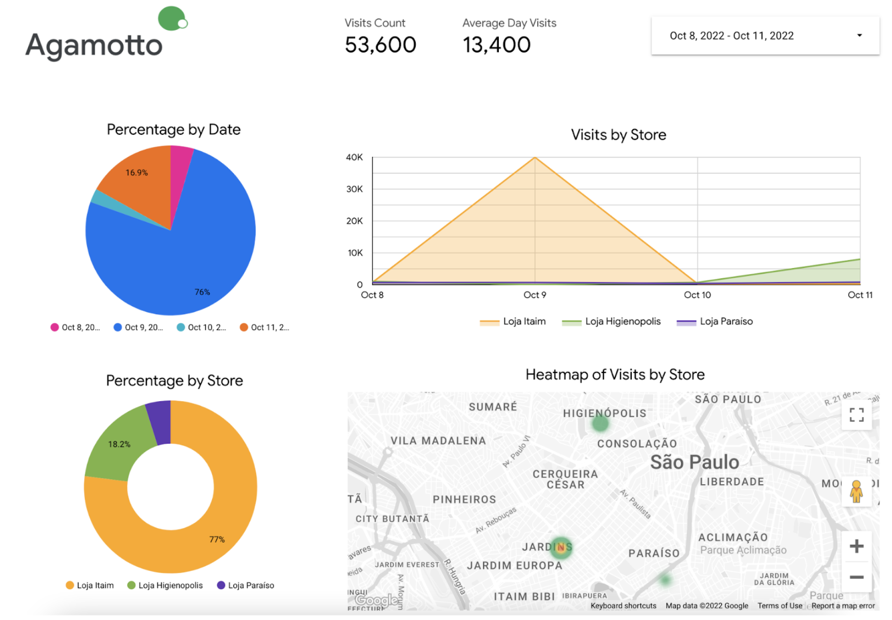

# Agamotto

[](https://github.com/PyCQA/pylint)

Agamotto is a open-source solution that uses Machine Learning to gather insights from physical locations using IoT. The initial version uses Computer Vision to read from cameras using OpenCV and send the data to BigQuery. Agamotto aims to be used to measure the impact of Marketing Campaigns on physical locations.

This is the count result


After send to Bigquery, you can create a dashboard:



## Pre-requisites

1. Docker (Preferred), Python 3.7+
2. Unix-based operating system
3. GCP - BigQuery and DataStudio (If you want to save your data on cloud)
4. 2GB+ RAM, 4GB+ GPU (If you want to train the model) 
5. Available stream endpoint, the default is a webcam (If you want to use video stream)

## How to Use

1. Go to the root folder and execute: 

``` shell
cd agamotto
docker build --no-cache . -t agamotto-model
docker run --name agamotto_container agamotto-model:latest
```

2. It will download the weights and a small dataset. (agamotto_data)
3. Then it will read video.mp4 and generate a output.avi video counting the number of persons. Copy the output to your machine using:
``` shell
docker cp agamotto_container:/usr/src/app/output.avi .
```
4. If you want to train, download the full dataset, insert into bigquery, use different videos and etc. Please see: agamotto/agamotto.yaml
5. If you want to use your own webcam go to the stream folder and execute:

``` shell
cd stream
pip3.7 install --no-cache-dir -r requirements.txt
python3.7 main.py
```

## Updates

- Better model improvement, datasets regarding humans and crowds and precise weights for Agamotto (coming soon)
- Heatmap data inside physical locations to determine where is the best spot (coming soon)

## Acknowledgements

This section objective is to thanks open-sourced code or material that contributed to the project's development.

- Agamotto's initial version was inspired by: https://keras.io/examples/vision/retinanet/ - Author: Srihari Humbarwadi
- Retinanet Paper: https://arxiv.org/abs/1708.02002
- Feature Pyramid Networks for Object Detection: https://arxiv.org/abs/1612.03144


## Disclaimer

This is not an official Google product.

NOTE: the content of this code repository (i) is not intended to be a
security monitoring project; and (ii) is not intended for non-anonymous use of any kind.